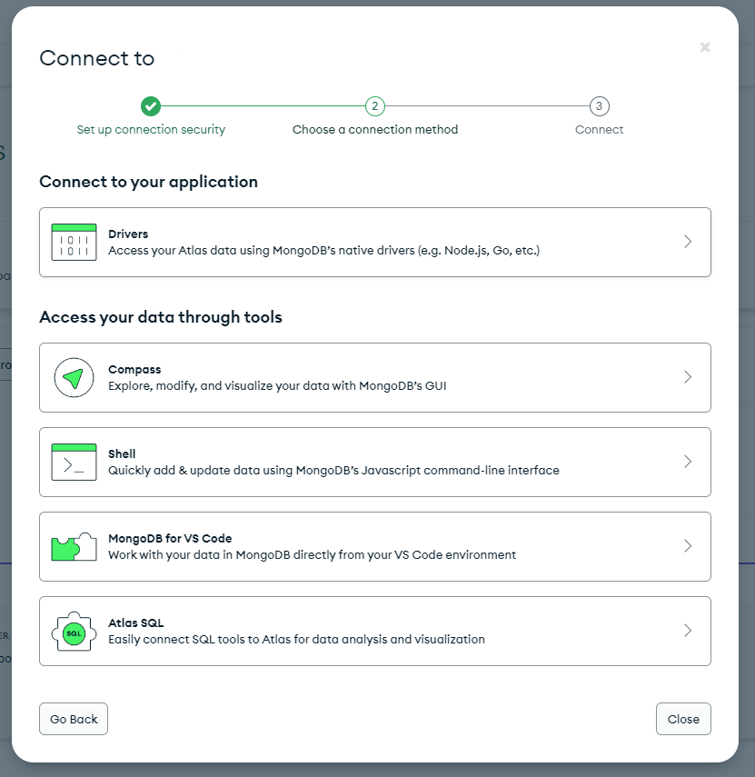
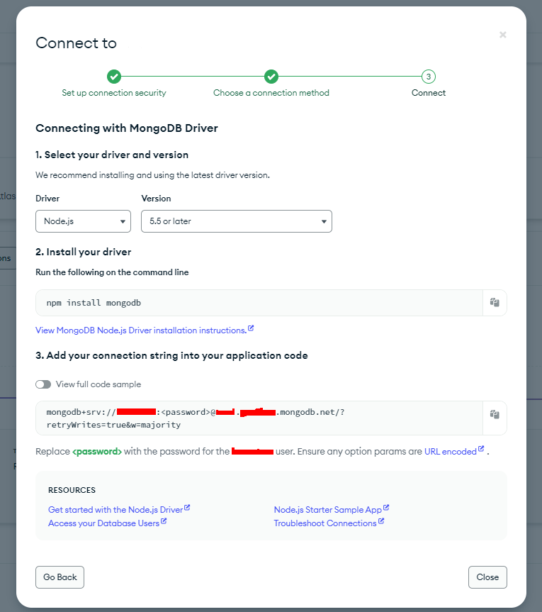

# What is AESI ? 🤖

AESI is a feature-rich Discord bot designed to bring an advanced economy system to your server, complete with various mini-games and more.

## Features 🎉

- **Economy System:** Build and manage your virtual wealth with a sophisticated economy system.
- **Daily Rewards:** Claim your daily rewards to earn coins and bonuses.
- **Mini-Games:** Engage in entertaining mini-games to earn extra rewards.
- **Bug Reporting:** Users can report bugs directly to improve the bot.
- **User-Friendly Commands:** Simple and intuitive commands for a smooth user experience.
- **Leaderboard:** Keep track of the top players and their balances.
- **Statistics:** Track your account balance and other statistics.

## Commands (/)

- `/admin add <user> <amount>` : Add coins from users balance.
- `/admin substract <user> <amount>` : Substract coins from users balance.
- `/balance <player>` : Check your current balance or another player.
- `/coinflip <heads or tails>` : Play a coinflip.
- `/daily` : Claim your daily rewards.
- `/donate <user> <amount>` : Donate to the user.
- `/help` : Get help with all of the commands.
- `/leaderboard` : Check the leaderboard (Top 10).
- `/machine <amount>` : Play a slot machine.
- `/report <type> <comment>` : Report a bug or suggestion.
- `/scratch` : Play a scratch card.
- `/stats` : Check your account stats.

## Installation 🎉

1. Clone the repository:

   ```bash
   git clone https://github.com/isweat-exe/AESI.git
   ```

## Configuration 📊

Add .env file in AESI folder, and copy this :
```env
DISCORD_TOKEN = <Bot Token>
GUILD_ID = <Your Server ID>
CLIENT_ID = <Your bot ID>

MONGODB_SRV = <Your URL connect - MongoDB> 
```

### How to have a URL ?

<br />


# Support 🤝

- Follow me on [GitHub](https://github.com/isweat-exe) ❤️
